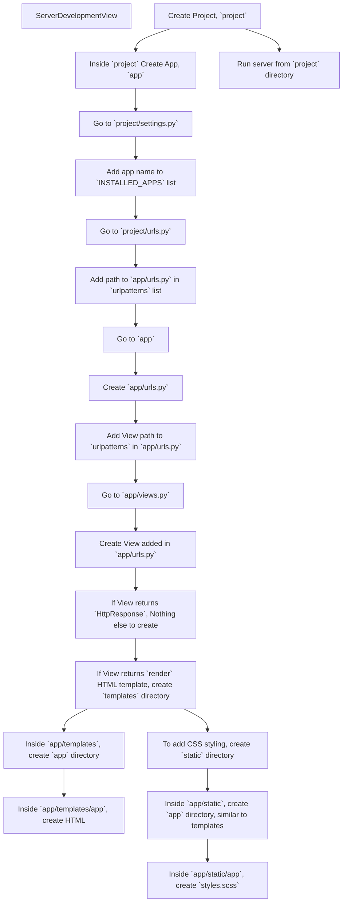

# Overview
- Django essentials or 'Django101' for building the E-commerce photo store
- [CS50 Notes for Django lecture](https://cs50.harvard.edu/web/2020/notes/3/)

[](https://codeium.com)


# Contents
- [Fundamentals](#fundamentals)
- [Takeaways](#takeaways)

</br>
<hr>

# Fundamentals
## Initiate Django
 - In Terminal proceed as follows :
    ```cmd
    >> django-admin startproject django101    :: create Django project

    >> cd django101   :: move to project directory

    >> python manage.py startapp myfirstapp        :: create an App inside project
    ```

## Project Execution
- In Terminal, in the project directory:
    ```cmd
    >> python manage.py    :: shows sub-commmands list

    >> python manage.py runserver  :: runs the server, identifies issues & changes
    ```

## Workflow



- Create Project, `project`
- Inside `project` Create App, `app`
- Go to `project/settings.py`
- Add app name to `INSTALLED_APPS` list
- Go to `project/urls.py`
- Add path to `app/urls.py` in `urlpatterns` list
- Go to `app`
- Create `app/urls.py`
- Add View path to `urlpatterns` in `app/urls.py`
- Go to `app/views.py`
- Create View added in `app/urls.py`
- If View returns `HttpResponse`, Nothing else to create
- If View returns `render` HTML template, create `templates` directory
	- Variables can be passed to template as a dictionary in `render()` syntax
- Inside `app/templates`, create `app` directory
- Inside `app/templates/app`, create HTML 
	- In the template, define Variables with Django-template language if neccessary
- To add CSS styling, create `static` directory
- Inside `app/static`, create `app` directory (similar to templates)
- Inside `app/static/app`, create `styles.scss`
- Run server from `project` directory 

<hr>


- Project is hosted on the web server at a specific URL which signifies `localhost`
- Webpage lists all apps inside the project
- Change URL from `https://localhost/` to `https://localhost/<app_name>`
- In the app, all available views are listed
- To render a view, change URL from `https://localhost/<app_name>/<view_name>`
- If the view requires an input parameter, change URL as `https://localhost/<app_name>/<view_name>/<input_parameter>`

</br>
<hr>

# Takeaways
## Terminal command to list directory tree

- To expand all files inside a directory in Windows Terminal, use the `tree` command. Here are the steps to follow:

    1. Open the Windows Terminal and navigate to the directory
    2. Type `tree /f ` and press Enter --> *lists directory tree*
        ```cmd
        D:\GitHub_Projects\cs50-webdev\django>tree /f
        Folder PATH listing for volume DATA
        Volume serial number is 841B-30E8
        D:.
        │   requirements.txt
        │
        └───django101
            │   manage.py
            │
            └───django101
                    asgi.py
                    settings.py
                    urls.py
                    wsgi.py
                    __init__.py
        ```

- To copy this list to clipboard, you can use the `clip` command as follows:
    - Type `tree /f | clip` and press Enter --> *copies directory tree to paste*


## Django file structure
- File structure is clearly based on distributing workload between Frontend, Backend and Databases
- `templates` consists of dynamic HTML content, which vary based on the input parameters
- `static` consists of static CSS styling, hence placed in static content


## Django-Templating language
<table border>
    <th>Syntax</th>
    <th>Function</th>
    <tr>
        <td>{{<code> variable </code> }}</td>
        <td>to render variables in the template, returned from <code>views.py</code> as <code>render</code> function</td>
    </tr>
    <tr>
        <td></td>
        <td>to return response based on the logic</td>
    </tr>
    <tr>
        <td></td>
        <td>alternate response</td>
    </tr>
    <tr>
        <td></td>
        <td>to indicate the end of If-Else block</td>
    </tr>
</table>