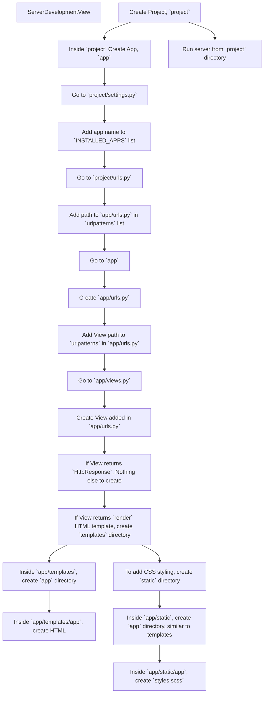
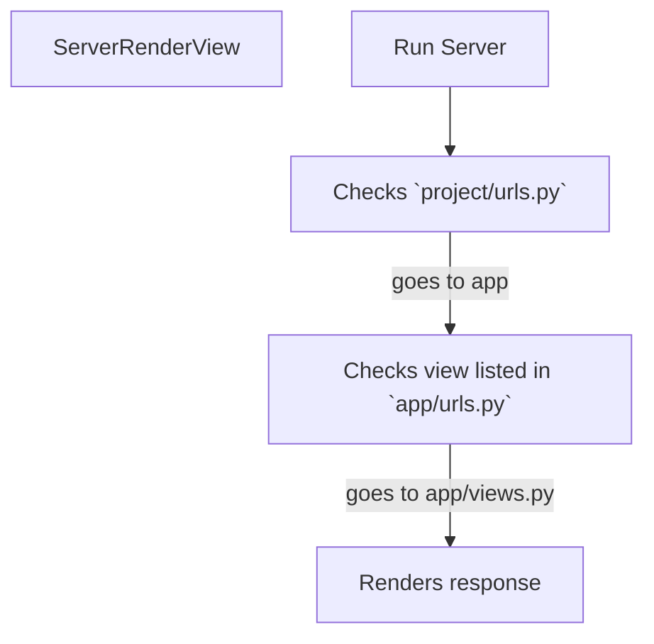

# Overview
- Learning Django essentials through CS50 lectures and assignments for building [DevSchool's course project](https://github.com/prak112/DevSchool-Project)
- CS50 Notes - [Django lecture](https://cs50.harvard.edu/web/2020/notes/3/)
- CS50 Notes - [SQL, Models and Migrations](https://cs50.harvard.edu/web/2020/notes/4/)

<br>

[](https://codeium.com)


# Contents
- [Fundamentals](#fundamentals)
    - [Initatie Django](#initiate-django)
    - [Project Execution](#project-execution)
    - [Workflow](#workflow)
- [Takeaways](#takeaways)
    - [Directory tree](#terminal-command-to-list-directory-tree)
    - [File Structure](#file-structure)
    - [Templating Language](#templating-language)
    - [Template Inheritance](#template-inheritance)
    - [Forms](#forms)
    - [Sessions](#sessions)
- Assignment 1 - [Wiki](/django/wiki/README.md)
    - [Application video demo](https://youtu.be/j7CwADYmysk)
- [Databases](/django/databases/README.md)

    
</br>
<hr>

# Fundamentals
## Initiate Django
 - In Terminal proceed as follows :
    ```cmd
    >> django-admin startproject django101    :: create Django project

    >> cd django101   :: move to project directory

    >> python manage.py startapp myfirstapp        :: create an App inside project
    ```

## Project Execution
- In Terminal, in the project directory:
    ```cmd
    >> python manage.py    :: shows sub-commmands list

    >> python manage.py runserver  :: runs the server, identifies issues & changes
    ```

## Workflow



- Create Project, `project`
- Inside `project` Create App, `app`
- Go to `project/settings.py`
- Add app name to `INSTALLED_APPS` list
- Go to `project/urls.py`
- Add path to `app/urls.py` in `urlpatterns` list
- Go to `app`
- Create `app/urls.py`
- Add View path to `urlpatterns` in `app/urls.py`
- Go to `app/views.py`
- Create View added in `app/urls.py`
- If View returns `HttpResponse`, Nothing else to create
- If View returns `render` HTML template, create `templates` directory
	- Variables can be passed to template as a dictionary in `render()` syntax
- Inside `app/templates`, create `app` directory
- Inside `app/templates/app`, create HTML 
	- In the template, define Variables with Django-template language if neccessary
- To add CSS styling, create `static` directory
- Inside `app/static`, create `app` directory (similar to templates)
- Inside `app/static/app`, create `styles.scss`
- Run server from `project` directory 

<hr>



- Project is hosted on the web server at a specific URL which signifies `localhost`
- Webpage lists all apps inside the project
- Change URL from `https://localhost/` to `https://localhost/<app_name>`
- In the app, all available views are listed
- To render a view, change URL from `https://localhost/<app_name>/<view_name>`
- If the view requires an input parameter, change URL as `https://localhost/<app_name>/<view_name>/<input_parameter>`


</br>
<hr>

# Takeaways
## Terminal Command to list Directory Tree

- To expand all files inside a directory in Windows Terminal, use the `tree` command. Here are the steps to follow:

    1. Open the Windows Terminal and navigate to the directory
    2. Type `tree /f ` and press Enter --> *lists directory tree*
        ```cmd
        D:\GitHub_Projects\cs50-webdev\django>tree /f
        Folder PATH listing for volume DATA
        Volume serial number is 841B-30E8
        D:.
        │   requirements.txt
        │
        └───django101
            │   manage.py
            │
            └───django101
                    asgi.py
                    settings.py
                    urls.py
                    wsgi.py
                    __init__.py
        ```

- To copy this list to clipboard, you can use the `clip` command as follows:
    - Type `tree /f | clip` and press Enter --> *copies directory tree to paste*


## File Structure
- File structure is clearly based on distributing workload between Frontend, Backend and Databases
- `templates` consists of dynamic HTML content, which vary based on the input parameters
- `static` consists of static CSS styling, hence placed in static content


## Templating Language
- Django documentation for [Templating Language](https://docs.djangoproject.com/en/4.2/ref/templates/api/)

<table border>
    <th>Syntax</th>
    <th>Function</th>
    <tr>
        <td>{{<code> variable </code> }}</td>
        <td>to render variables in the template, returned from <code>views.py</code> as <code>render</code> function</td>
    </tr>
    <tr>
        <td></td>
        <td>to return response based on the logic</td>
    </tr>
    <tr>
        <td></td>
        <td>alternate response</td>
    </tr>
    <tr>
        <td></td>
        <td>to indicate the end of If-Else block</td>
    </tr>
    <tr>
        <td></td>
        <td>items in list can looped over to build HTML list</td>
    </tr>
    <tr>
        <td></td>
        <td>Inside for-loop, option to display a static message when there are no items to loop-over</td>
    </tr>
    <tr>
        <td></td>
        <td>to indicate the end of For-loop block</td>
    </tr>
    <tr>
        <td></td>
        <td>to indicate the dynamic content probably added in other HTML files. 
        Details in <a href="#django-template-inheritance">Django Template Inheritance</a></td>
    </tr>
    <tr>
        <td></td>
        <td>to indicate the end of the dynamic content block</td>
    </tr>
    <tr>
        <td></td>
        <td>to navigate between different urls, For ex. <code>path("", views.index, name='index')</code>, in this case the route name is <code>'index'</code></td>
    </tr>
</table>


## Template Inheritance
- Tutorial about [Template Inheritance from DjangoGirls](https://tutorial.djangogirls.org/en/template_extending/) 
- Template Inheritance is useful for ensuring the uniformity of HTML boilerplate code, i.e., layout for all pages within an application
- Create file `layout.html` in `app/templates/app`
- Within `layout.html`, define the dynamic content within the layout as follows :
    ```html
    <html>
        <head>
            <title></title>
        </head>
        <body>
            
            
        </body>
    </html>
    ``` 
- Inside other HTML files, where the dynamic content can be added is done as follows :
    ```html
     {% extends "app/layout.html"}
     
        
            <!-- dynamic content here -->
        
    ```

## Forms
- `django.forms` module helps in defining Form elements
- Form structure needs to be defined through HTML opening `<form>` and closing `</form>` tags in `template.html`
- Form elements can be defined in `views.py` from the specific function that is rendering the form
- Form data submission requires to be secured through *Django Middleware*
- To secure form data submission, inside the HTML `<form>` tag a token must be passed as follows:
    ```html
    
    ```
- For example, the above token could render as following inside HTML Form :
    ```html
    <input type="hidden" name="csrfmiddlewaretoken" value="l3XqWpeqf9a3dww21khx64OaxluaYdxYEB9R0SCLnfJCEScSCD6qgH8JmBXcR7VF">
    ```
- To know more about [CSRF](https://portswigger.net/web-security/csrf) 

- This allows Django to verify and ensure data credibility without external interference, since the tokens are unique and random
- Django also automates *Client-side validation*
- To ensure data credibility and server-side modifications, *Server-side validation* is a recommended approach 
- To redirect users after performing any main action, such as submitting form data, the following `return` syntax is useful :
    ```python
    from django.urls import reverse
    from django.http import HttpResponseRedirect

    def index(request):
        # server-side validation
        ... 
    return HttpResponseRedirect(reverse('<route_name>'))
    ```

## Sessions
- In the applications, *global variables* were used inside `views.py`
- However, *global variables* tend to show same data to all users
- Hence, to protect privacy and for better user experience *session variables* can be added as follows :
    ```python
    def index(request):
        if "user_session" not in request.session:
            request.session["user_session"] = []
        
        # server-side validation
        ...

        return render(request, 'app/template.html', context={
            "user_data": request.session["user_session"]
        })
    ```
- From this step forth, Django saves all data in default database tables
- Hence, server throws an `OperationalError` saying `no such table: django_session`
- To deal with this, `migrate` the project which allows Django to create all default database tables
- This resolves the `OperationalError` and launches the application successfully, with built-in session data storage.


