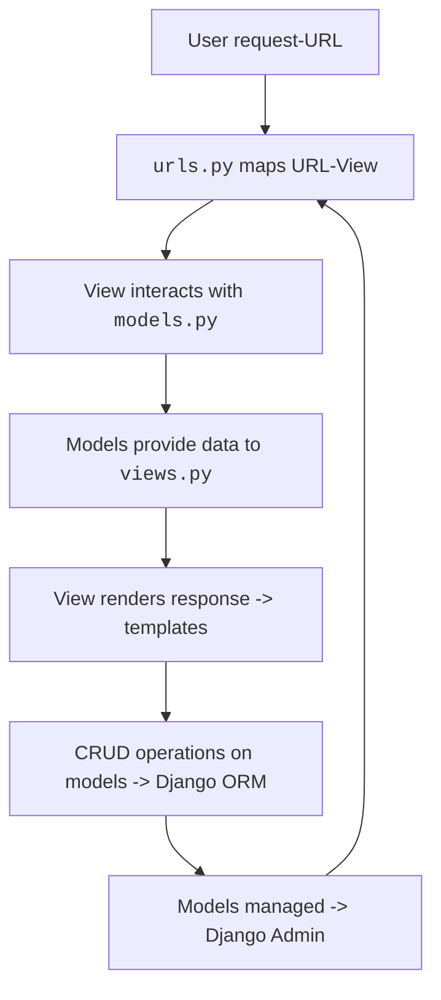

# OverView
- To learn and practice :
    - Database essentials in *SQLite*, 
    - Leveraging *Django Models* for data representation, 
    - Managing table relationships and
    - *Django Admin* for managing user access
- CS50W Notes on [Lecture 4 - SQL, Models and Migrations](https://cs50.harvard.edu/web/2020/notes/4/)

<br>

# Contents
 - [Fundamentals](#fundamentals)
 - [SQLite](#sqlite)
    - [Syntax](#syntax)
    - [Access](#access)
    - [Working in Command Line](#working-in-command-line)
    - [JOIN tables](#join-tables)
- [SQL Vulnerabilites](#sql-vulnerabilities)
    - [SQL Injection](#sql-injection)
    - [Race Conditions](#race-conditions)
- [Django Workflow](#django-workflow)
- [Django Models](#django-models)
    - [Model Relationships](#model-relationships)
    - [Model-View Workflow](#model-view-workflow)
- [Django Shell](#django-shell)
    - [Django ORM](#django-orm-object-relational-mapping)
    - [ORM Workflow](#orm-workflow)
- [Django Admin](#django-admin)


<br>

- [Back To Django](/django/README.md)
- [Back To Main](/README.md)

<br>

[](https://codeium.com)

<hr>

# Fundamentals
- Forms of databases - 
    - **Relational Databases** - for structured or tabulated data
    - **NoSQL** - for non-structured data
- Most popular forms of **Relational Databases** : *MySQL*, *PostgreSQL(Postgres)*, *SQLite*
- *SQLite* stores data as a single file instead of database servers as in *MySQL*, *Postgres* or *Microsoft SQL Server*
- *SQLite* also happends to be *Django's* default database
- Data types supported by *SQLite* :
    - Text
    - Numeric - any kind of data including numbers, such as dates, boolean values, etc.
    - Integer
    - Real - floats and decimals
    - BLOB (Binary Large OBject) - pure binary data of audio, images or videos

- Column constraints for database design and data integrity :

<table border>
    <th>Constraint</th>
    <th>Description</th>
    <th>Example (part of <code>CREATE TABLE</code> query syntax)</th>
    <tr>
        <td><b>PRIMARY KEY</b></td>
        <td>to uniquely identify each row in the table</td>
        <td><code>id INTEGER PRIMARY KEY</code></td>
    </tr>
    <tr>
        <td><b>AUTOINCREMENT</b></td>
        <td>to automate unique value generation for each row</td>
        <td><code>id INTEGER PRIMARY KEY AUTOINCREMENT</code></td>
    </tr>
    <tr>
        <td><b>NOT NULL</b></td>
        <td>to ensure column cannot have NULL values</td>
        <td><code>name TEXT NOT NULL</code></td>
    </tr>
    <tr>
        <td><b>UNIQUE</b></td>
        <td>to ensure unqueness of values in the column</td>
        <td><code>name TEXT UNIQUE</code></td>
    </tr>
    <tr>
        <td><b>CHECK</b></td>
        <td>to define a condition that column values must fulfill</td>
        <td><code>birthyear INTEGER CHECK(birthyear >= 1999)</code></td>
    </tr>
    <tr>
        <td><b>DEFAULT</b></td>
        <td>to set a default value when no value is provided</td>
        <td><code>gender TEXT DEFAULT "non-binary"</code></td>
    </tr>
    <tr>
        <td><b>REFERENCES</b></td>
        <td>to create foreign key relationship/s with other table/s</td>
        <td><code>user_id INTEGER REFERENCES Users(id)</code></td>
    </tr>
</table>

<br>

# SQLite
## Syntax
- Create table with columns
    ```sql
    CREATE TABLE users(
        id INTEGER PRIMARY KEY AUTOINCREMENT,
        fullname TEXT NOT NULL UNIQUE,
        birthyear INTEGER CHECK(birthyear >= 1900),
        gender TEXT DEFAULT "non-binary",
        email TEXT NOT NULL UNIQUE
    );
    ```

- Insert data into table columns
    ```sql
    INSERT INTO users
        (fullname, birthyear, gender, email)
        VALUES ("Rama Rao", 1960, "male", "ntr@dvsk.com");
    ```

- Read data from tables in the database
    ```sql
    SELECT * FROM users LIMIT 10; /* displays 10 rows with all columns
    ```

## Access
- SQL databases and tables can be managed in the following ways :
1. **Command Line** ( *IDEAL, (my situation) but project and PATH directories mismatch* )
    - Go To [SQLite Download page](https://www.sqlite.org/download.html)
    - Download *sqlite-tools*
    - Set your system's PATH Environment Variables to *sqlite-tools* PATH
    - Build, manage, execute databases and tables from Command Line

2. **VS Code Extension** (*NOT IDEAL for learning fundamentals, maybe to build development workflow*)
    - Install 3rd-Party SQLite Extension by alexcvzz
    - Build, manage, execute databases and tables from VS Code

3. **Conda Virtual Environment** (*IDEAL, all in one place!*)
    - Create a virtual environment for Web Development with Python - 
        ```cmd
        conda create --name  py311-webdev
        ```
    - Activate the created virtual environment -
        ```cmd
        conda activate py311-webdev
        ```
    - Install *python 3.11* and other libraries including *sqlite3* required for development workflow - 
        ```cmd
        conda install sqlite3
        ```
    - Access sqlite3 and start creating and managing databases and tables -
        ```cmd
        sqlite3
        ```

## Working in Command Line
- `sqlite` runs as an application inside the terminal
- Tables can be created using the regular SQL syntax, 
    ```sql
    CREATE TABLE
    ...
    ```
- Default query output for the `users` table is as follows :
    ```sql
    sqlite> SELECT * FROM users;

    id|fullname|birthyear|email
    1|Pikachu|2023|pika@pokemon.com
    2|Charmander|2022|char@pokemon.com
    3|Squirtle|2021|squirtle@pokemon.com
    4|Bulbasaur|2018|bulba@pokemon.com
    5|Eevee|2015|eevee@pokemon.com
    6|Jigglypuff|2020|jiggly@pokemon.com
    ```
- To format the output, we execute the following :
    ```sql
    sqlite> .mode columns
    sqlite> .headers yes 
    ```
- Now the same query returns a formatted table, as follows :
    ```sql
    sqlite> SELECT * FROM users;

    id  fullname    birthyear  email
    --  ----------  ---------  --------------------
    1   Pikachu     2023       pika@pokemon.com
    2   Charmander  2022       char@pokemon.com
    3   Squirtle    2021       squirtle@pokemon.com
    4   Bulbasaur   2018       bulba@pokemon.com
    5   Eevee       2015       eevee@pokemon.com
    6   Jigglypuff  2020       jiggly@pokemon.com
    ```
- Once closed, the `sqlite` application returns to its default settings
- To open the `.sql` files created earlier :
    ```sql
    sqlite> .open users.sql
    sqlite> .tables
    users
    ```

## JOIN tables
- INNER JOIN 
    - displays the data between LEFT(`users`) and RIGHT(`roles`) tables where only the referenced columns have matching data
        ```sql
        sqlite> SELECT fullname, birthyear, role 
        ...>    FROM users JOIN roles
        ...>    ON users.id = roles.user_id;

        fullname    birthyear  role
        ----------  ---------  --------
        Bulbasaur   2018       Blogger
        Pikachu     2023       Blogger
        Charmander  2022       Gamer
        Jigglypuff  2020       Designer
        Eevee       2015       Designer
        ```

- LEFT OUTER JOIN
    - LEFT table - displays all data from LEFT table,
    - RIGHT table - displays only matched data with LEFT table column reference
        ```sql
            sqlite> SELECT * FROM users LEFT JOIN roles ON users.id = roles.user_id;

            id  fullname    birthyear  email               age  id  role      user_id
            --  ----------  ---------  ------------------  ---  --  --------  -------
            1   Pikachu     2023       pika@pokemon.com    0    3   Blogger   1
            2   Charmander  2022       char@pokemon.com    1    4   Gamer     2
            4   Bulbasaur   2018       bulba@pokemon.com   5    2   Blogger   4
            5   Eevee       2015       eevee@pokemon.com   8    6   Designer  5
            6   Jigglypuff  2020       jiggly@pokemon.com  3    5   Designer  6
            7   Squirtle    2015       squirt@pokemon.com  8
        ```

- RIGHT OUTER JOIN
    - LEFT table - displays only matched data with RIGHT table column reference,
    - RIGHT table - displays all data from RIGHT table
        ```sql
            sqlite> SELECT * FROM users RIGHT JOIN roles ON users.id = roles.user_id;
            id  fullname    birthyear  email               age  id  role      user_id
            --  ----------  ---------  ------------------  ---  --  --------  -------
            1   Pikachu     2023       pika@pokemon.com    0    3   Blogger   1
            2   Charmander  2022       char@pokemon.com    1    4   Gamer     2
            4   Bulbasaur   2018       bulba@pokemon.com   5    2   Blogger   4
            5   Eevee       2015       eevee@pokemon.com   8    6   Designer  5
            6   Jigglypuff  2020       jiggly@pokemon.com  3    5   Designer  6
                                                                1   Gamer     3        
        ```

- FULL OUTER JOIN
    - displays all data combined from LEFT and RIGHT tables either matched or unmatched
        ```sql
            sqlite> SELECT * FROM users FULL JOIN roles ON users.id = roles.user_id;

            id  fullname    birthyear  email               age  id  role      user_id
            --  ----------  ---------  ------------------  ---  --  --------  -------
            1   Pikachu     2023       pika@pokemon.com    0    3   Blogger   1
            2   Charmander  2022       char@pokemon.com    1    4   Gamer     2
            4   Bulbasaur   2018       bulba@pokemon.com   5    2   Blogger   4
            5   Eevee       2015       eevee@pokemon.com   8    6   Designer  5
            6   Jigglypuff  2020       jiggly@pokemon.com  3    5   Designer  6
            7   Squirtle    2015       squirt@pokemon.com  8
                                                                1   Gamer     3
        ```

# SQL Vulnerabilites
## SQL Injection
- SQL query syntax if deployed in its raw form would lead to exposure to hackers
- For example, consider the following simple query for a user accessing the application :
    ```sql
    SELECT * FROM users WHERE username="pikachu" AND password="pika123";
    ```
- If a hacker wanted to gain access to application without logging in, they could just enter username as "hacker" --", which results in the following :
    ```sql
    SELECT * FROM users WHERE username="hacker"--" AND password="";
    ```
    - Here SQL is considering the query post "--" as a comment and hence provides access to the application
- Strategies to solve could be to use :
    - *Stored Procedures* in Database Management Systems
    - *Django Models* in Django


## Race Conditions
- Events happening on parallel threads could conflict database operations
- Locking database during a transaction until it is done, would be strategic

<br>
<hr>

# Django Workflow
- User sends a request through the URL.
- `urls.py` in the project directory maps the URL to a View function or class.
- The View function or class in `views.py` handles the request and interacts with the necessary models.
- The models in `models.py` provide the necessary data to the View.
- The View renders the response using templates.
- CRUD operations (Create, Read, Update, Delete) can be performed on the models in models.py using Django's ORM (Object-Relational Mapping).
- Models can be managed and manipulated using the Django Admin web interface


<br>
<hr>

# Django Models
- Models provide the structure to interact with *[Django ORM](#django-orm-object-relational-mapping)* tool through *python classes* and *properties*
- Models are defined with [relationships](#model-relationships) to one another, similar to a Relational Database

## Model Relationships
- *Models* exist with relationships just like SQL tables
- Fields can be referenced through `model.ForeignKey()` to the *referenced Model*
- To label a relation between *related Model* and *referenced Model*, `related_name` parameter is to be defined
- `related_name` creates a reverse relationship between these *Models*. 
- Defining `related_name` could be simplified by the following questions : 
    - *"If I know Foreign Key column value, What would I label the result set generated with it as the filter ? "* 
    <br> OR
    - *"With this value as filter, what category of results can be generated ?"*
    <br>
    - *In SQL query, SELECT * FROM table WHERE "filter", what would be "filter"-label?*
    ```python
    ...

    # referenced model
    class Department(models.Model):
        name = model.CharField(max_length=20)

    # related model
    class Employee(models.Model):
        name = model.CharField(max_length=50)
        department = model.ForeignKey(Department, on_delete=models.CASCADE, related_name="employees")

    ```

- A simplified example to differentiate between One-To-Many and Many-To-Many relationships
    ```python
    ...

    # referenced model
    class Forest(models.Model):
        name = model.CharField(max_length=40)
        location = model.CharField(max_length=40)
        
        def __str__(self):
            return f"Forest {self.name} located in {self.location}"
        
    # related model
    class Animals(models.Model):
        species = model.CharField(max_length=40)
        # One-To-Many Relationship of relating each Forest-To-multiple Animals
        habitat = model.ForeignKey(Forest, on_delete=models.CASCADE)
        # Many-To-Many Relationships of relating multiple Forests-To-multiple Animals
        habitat = model.ManyToManyField(Forest)
    ```
- Changes in `models.py` are to applied to the database by migrating changes through [2-step process](#orm-workflow)


## Model-View Workflow
- *Models* define the data to be presented in the *View* based on the User request URL
- Defining the data requires dealing with the database
- As shown [above](#model-relationships), *Models* define structure of database which is implemented upon executing the [2-step process](#orm-workflow)
- *Views* define how the data is rendered.
- For example: render an index page to show all flights, but in a browser not in *ORM*
    ```python
    # views.py
    ...

    def index(request):
        return render(request, "flight/index.html", context={"flights": Flight.objects.all()})
    ```

    - Before `layout.html` is defined to extend the template
    ```html
    <!-- index.html -->
    

    
        <h1>Flights</h1>
        <ul>
            
                <li>Flight {{flight.id}}: {{flight.origin}} To {{flight.destination}}, {{flight.duration}} minutes</li>
            
        </ul>
    
    ```
    
    - As a result, the server renders the view
    

<br>

# Django Shell
- *Django shell* is a CLI provided by Django that allows to interactively execute *Python* code within the context of a Django project. 
- It provides a convenient way to test and explore the application, including working with the ORM.

- In *Django shell*, models can be imported and CRUD operations can be performed. 
- Arbitrary *Python* code can also be executed to perform other tasks related to Django application.

## Django ORM (Object Relational Mapping)
- *Django Shell* provides an abstraction layer tool (ORM) to interact with databases

- *Django ORM* allows to define, manipulate databases, tables, records using *Python* by tinkering with Models' classes and its properties
- *Django ORM* helps in implementing and managing databases and tables without worrying about SQL syntax or SQL vulnerabilities.
- *Django ORM* encompasses the mapping of *Python* objects to its database's tables and the API for interacting with those objects.

- The procedure to use *Django Models, Shell* and *ORM* starts with [standard creation](/django/README.md/#initiate-django) of project and app using *Django*
- Firstly intialize `settings.py` in the project and `urls.py` in the project and the app 
- Create a `class` in `models.py` with instructions that would add information about the *Models*. For example :  
    ```python
    from django.db import models

    class Flight(models.Model):
    origin = models.CharField(max_length=72)
    destination = models.CharField(max_length=72)
    duration = models.IntegerField()
    ```
## ORM Workflow
1. Updated *Models* information in `models.py` would be implemented in `migrations/` directory by *Django* 
    - Execute `makemigrations` to create an initialization file depicting the changes to database
    ```cmd
    $ path/to/project> python manage.py makemigrations
    ```
2. Updated changes in `migrations/` directory should be applied to the database
    - Execute `migrate` to reflect changes in database, *Models* and *Views*
    ```cmd
    $ path/to/project> python manage.py migrate
    ```
- Post updating, `migrations/` directory would be listed with initialization files depicting recent changes in `models.py`
    ```cmd
        ─migrations
        │   0001_initial.py
        │   0002_airport_alter_flight_destination_alter_flight_origin.py
        │   0003_alter_flight_destination_alter_flight_origin_and_more.py
        │   0004_airport_alter_flight_destination_alter_flight_origin.py
        │   __init__.py
    ```
- Updated database can be accessed through *Django*'s in-built `shell`
    ```cmd
    $ path/to/project> python manage.py shell
    
    rem Import model
    >>> from flights.models import Flight                                       
    
    rem Insert data
    >>> f = Flight(origin="Helsinki", destination="Hyderabad", duration=650)    
    
    rem Save data
    >>> f.save()

    rem Display all saved objects
    >>> Flight.objects.all()   
    <QuerySet [<Flight: Flight object (1)>]>

    rem Display first object
    >>> Flight.objects.first()  
    <Flight: Flight object (1)>
    ```
- For a detailed View of the object, a string representation function (`def __str(self)__`) can be created in Flight `class`
- To View the changes, `exit()` from `shell` and access database again
- Represented string can be Viewed by repeating the same procedure as above, since, `shell` has temporary memory
- Independent values of object can also be Viewed by accessing `class properties`
    ```cmd
    rem Access object properties
    >>> from flights.models import Flight 
    >>> f1 = Flight.objects.first()
    >>> f1.id
    1
    >>> f1.origin
    'Helsinki'
    >>> f1.destination
    'Hyderabad'
    >>> f1.duration
    650
    ```
<br>

# Django Admin
- *Django Admin* allows to manage the *Models* from a web interface 
- Create *superuser* using `manage.py` in the terminal
    ```cmd
    rem Create superuser
    $ path/to/project> python manage.py createsuperuser
    ```
    - Registration procedure requires `Username`, `Email address`, `Password`
- In the app directory, `flights/`, inside `admin.py` register the created *Models*
    ```python
    # admin.py
    ...
    from flights.models import Airport, Flight

    # register models
    admin.site.register(Airport)
    admin.site.register(Flight)
    ```
- Run server and access `localhost/admin` to interact with *Django Admin* app
- Login and perform CRUD operations as required with registered *Models*
