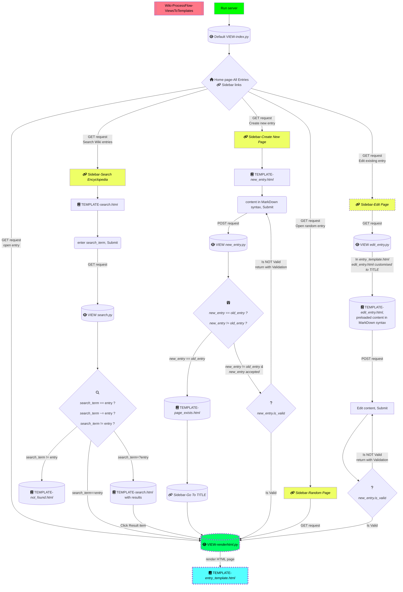

# Contents
- [Overview](#overview)
- [Installation]()
- [Workflow](#workflow)
    - [Description](#description)
    - [Illustration](#illustration)
    - [Video Demo](https://youtu.be/j7CwADYmysk)
- [Credits](#credits)
- [Back To Main](/django/README.md) 

<br>
<hr>


# Overview
- This project is a Wiki web application which provides a user-friendly input format in markdown for any user entries, which are then converted to `html` and saved in the database.
- Installation, workflows and demo video of application functionality are provided in this document.
- For further details, refer [TASKS](/django/wiki/docs/TASKS.md)
- For details on how issues were handled, refer [DEBUG_LOG](/django//wiki/docs/DEBUG_LOG.md)

<hr>
<br>

# Installation
To set up this project, follow these steps:

1. **Clone the Repository**:
```bash
    git clone https://github.com/prak112/cs50-webdev.git
    cd cs50-webdev/django/wiki
```

2. **Set Up a Virtual Environment**:
```bash
    # Ensure Python 3.11.x is installed
    python3.11 --version

    # Create a virtual environment using Python 3.11.x
    python3.11 -m venv venv

    # Activate the virtual environment
    # For Windows
    .\venv\Scripts\activate

    # For macOS/Linux
    # source venv/bin/activate
```

3. **Install Dependencies**:
```bash
    pip install -r requirements.txt
```

4. **Apply Migrations**:
```bash
    python manage.py migrate
```

5. **Run the Development Server**:
```bash
    python manage.py runserver
```

6. **Access the Application**:
    - `Ctrl + Click` on the link `http://127.0.0.1:8000/` in your terminal to redirect to the web page.

For more detailed instructions, refer to the [`README.md`](/django/README.md) file in the `django` directory.


# Workflow
## Description
- Process flow of the application is as listed below :
- Application executed from `localhost` server
    ```cmd
        $ path/to/dir/wiki> python manage.py runserver
    ```
- *Home page* 
    - redirects current URL path to `index` view
    - all entries are listed
- *Click an entry* 
    - redirects current URL to that specific entry in HTML version through `renderhtml` view
- *Search for an entry* 
    - redirects to `search.html`
    - search term sent as `GET` request to `search` view
    - `search` view redirects to entry, if search term = entry
    - `search` view lists all possible entries with similar label to search term
    - `search` view redirects to `not_found.html` if no results
- *Edit an entry* 
    - redirects to `edit_entry.html` with pre-filled content from original entry
    - updated entry submission received by `edit_entry` view
    - redirects to updated entry in HTML version
    - if invalid, redirected to `edit_entry.html` to correct errors
- *Create an entry* 
    - redirects to `new_entry.html`
    - entry created and submitted in Markdown syntax
    - if entry already exists, renders `page_exists.html` with  `Go To TITLE` hyperlink in sidebar
    - if entry accepted, redirected to `TITLE.html` through `renderhtml` view
    - if entry invalid, redirected to `new_entry.html` for correction
- *Markdown to HTML conversion*
    - entries saved in `wiki/entries/` as `.md` file through `util.save_entry`
    - `renderhtml` view uses `with open ()` to read entry content
    - entry content converted to `html_content` using `markdown2`
    - converted markdown content saved to `html_content`
    - `html_content` written to `html_file` using `with open()`
    - `renderhtml` renders `entry_template.html` with `html_content`


## Illustration



# Credits
- Coding Assistant **ChatGPT 3.5** 
- [Favicon Generator](https://favicon.io/favicon-generator/), Created by John Sorrentino