# Contents
- [Overview](#overview)
- [Tasks-Solutions](#tasks---solutions)
    - [Index](#index)
    - [Entry Page](#entry-page)
    - [Search Entries](#search-entries)
    - [New Page](#new-page)
    - [Edit Page](#edit-page)
    - [Random Page](#random-page)
    - [Markdown to HTML Conversion](#markdown-to-html-conversion)
- [Key Takeaways](#key-takeaways)
- [Workflow](#workflow)
    - [Description](#description)
    - [Illustration](#illustration)
    - [Video Demo](https://youtu.be/j7CwADYmysk)
- [Credits](#credits)
- [Back To Main](/django/README.md) 

<br>
<hr>


# Overview
- Assignment is to build an Encyclopedia web application, for example: Wiki for Web Development.
- Every encyclopedia provides the possibility for a human-friendly entry format to contribute easily, in this case it is through Markdown entries.
- Every entry should be converted to HTML before rendering which will be done using [`markdown2`](https://github.com/trentm/python-markdown2) library

- Assignment is provided with a zipped file of distribution code consisting of 
    - pre-built `wiki` django project with Frontend for `encyclopedia` application
    - preset `wiki/settings.py`, `wiki/urls.py` and `encyclopedia/urls.py`
    - `util.py` for handy functions such as, `list_entries`, `get_entry`, `save_entry`, which are self-explanatory and useful for completing the assignment,
    - `entries` folder with Markdown entries which are to be rendered as a HTML file before rendering the view,
    - `encyclopedia/templates` is provided with `layout.html` and `index.html` to render dynamic content


# Tasks - Solutions
## Index        
- [X] **Index** - hyperlink all the entries listed in the Wiki homepage
    - Step 1: Check `Django Template Engine` syntax for hyperlink using `<a>` tag
    - Step 2: Use the *route name* `index` for `<a href="">` inside the `li` tag in `index.html` as follows :
        ```html
        <!--django template engine, loop entries-->
            <li><a href="">{{ entry }}</a></li>
            <!--'renderhtml' - 'route name' for the view -->
            <!--'entry' - input parameter for 'renderhtml'--->
        <!--end for loop-->
        ```


## Entry Page
- [X] **Entry Page** - render by visiting url `wiki/TITLE`, where `TITLE` is the name of the entry
    - Step 1: Convert Markdown entries in `entries` to HTML files in `encyclopedia/templates`
    - Step 2: Configure URL in `encyclopedia/urls.py` as :
        ```python
            # renders all listed titles and not found pages
            path("<str:title>", views.renderhtml, name="renderhtml")  # --> renders as default view for all sidebar links
            path("renderhtml/<str:title>", views.renderhtml, name="renderhtml")  # --> renders only when called for
        ```
    - Step 3: Define view to render multiple views with a selection block (`if-else`) in `encyclopedia/views.py`
    - Step 4: Include view in `encyclopedia/urls.py`
    - Step 5: In the view, `renderhtml` if the `TITLE.html` does not exist, then convert Markdown(`/entries`) to HTML(`/templates/encyclopedia`)
    - Step 6: Convert the saved entry from `TITLE.md` to `TITLE.html` using `subprocess` module as follows:
        ```python
            # convert Markdown to HTML
            markdown_file = os.path.join(settings.BASE_DIR, f"entries\\{title}.md")   
            html_file = os.path.join(settings.BASE_DIR, f"encyclopedia\\templates\\encyclopedia\\{title}.html")
            # secure conversion            
            with open (markdown_file, "r") as md_file:
                markdown_conent = md_file.read()
                html_content = markdown2.markdown(markdown_conent)
            with open (html_file, "w") as html_file:
                html_file.write(html_content)
            
            # alternate, but vulnerable
                # cli_command = f"python -m markdown2 {markdown_file} > {html_file}"
                # subprocess.run(cli_command, shell=True, check=True)
        ```
    - Step 7: Automate the rendering of every Markdown entry as HTML without changing the HTML manually as follows:
        - Every `edit_entry` and `new_entry` request creates a new markdown file, which will be converted into a fundamental HTML without the Django Template, `layout.html`
        - To automate HTML rendering with `layout.html`, an `entry_template.html` can act as a gateway to extend `layout.html` to every entry
            ```html
                

                
                    {{ title }}
                

                
                    <a href="">Edit Page</a>
                

                
                    {{ html_content|safe }}
                
            ```
        - Every markdown entry created by `new_entry` and `edit_entry` will redirect the saved markdown content to `renderhtml`
        - In the view, `renderhtml`, convert markdown to HTML and pass the `html_content` to `entry_template.html` to render the updated markdown file with `layout.html`
            ```python
                def renderhtml(request, title):
                    ...
                    # convert Markdown to HTML
                    ...

                    return render(request, 'encyclopedia/entry_template.html', context={'html_content':html_content, 'title': title})
            ```


## Search Entries
- [X] **Search Entries** - enable search box in sidebar to search for Wiki entries
    - Step 1: Set up URL config in `encyclopedia/urls.py`
    - Step 2: Create view with following logic :
        - Get a list of all entries through `util.get_entries()`
        - Compare the `search_term` with the list of entries
        - Collect the result set
        - Pass and render it on the template as follows:
            ```html
            
                
                    <li><a href="">{{ result }}</a></li>
                
            
            ```
    - Step 3: Change `<form>` element in `encyclopedia/layout.html` to `<a>` element to redirect to `search.html`
    - Step 4: Move all forms classes, `NewForm` and `SearchForm` from `views.py` to `forms.py`
    - Step 5: Render `SearchForm` fields in `search.html` template
    - Step 6: Since we are requesting data it is a `GET` request. Hence, `<form>` element in template and `form` variable in view will access data through `GET`
    - Step 7: In the view, either render exact results or list of entries consisting of the `search_term` or `not_found` template


## New Page
- [X] **New Page** - enable '*Create New Page*' link in sidebar to create a new entry
    - Step 1: Set up URL config in `encyclopedia/urls.py`
    - Step 2: In `encyclopedia/views.py`, import `django.forms` to create form fields for title, content area and submit button
    - Step 3: Create and render basic view `new_entry` with form fields
    - Step 4: Process form data submission by adding `if-else` blocks to check for validity of `request` and data 
    - Step 5: Use `util.save_entry(title, content)` function with required parameters to save the user entry to `entries`
    - Step 6: User is redirected to the new entry through `renderhtml` view
    - Step 7: If entry exists already, render `page_exists.html` with reference to existing page in sidebar
    - Step 8: If form data invalid, render form data with *Client-side validation* error messages

## Edit Page
- [X] **Edit Page** - enable '*Edit Page*' option in each entry page to edit, save and redirect to an updated entry
    - Step 1: Identify the task as specific to each individual HTML file, since the content must be repopulated
    - Step 2: URL config in `encyclopedia/urls.py` (URLs are global to all HTML files)
    - Step 3: Start with one HTML, by adding `` inside `` dynamice content for navigation links
        - Step 3.1: `arg` would be `title` and `value` would be name of the topic, hence `topic`
        - Step 3.2: Go to `renderhtml` view, pass `title` as `topic` in `return` statement 
    - Step 4: Create template `edit_entry.html` with form elements from `Class NewForm()`
    - Step 5: Create view `edit_entry` as follows:
        1. fill form with initial data
        2. check if form data has changed
        3. if form data has changed, check if "POST" request
        4. if "POST" request, check if updated_form data is valid
        5. if valid, save updated form data
        6. convert Markdown to HTML
        7. redirect to renderhtml
    - Step 6: NEVER refresh the browser during debugging form data submissions! 
            <details>
                <summary><b>Double Submitting Form</b></summary>
                <p>If a user submits a form and then refreshes the page, the browser might prompt them to confirm re-submitting the data.</p>
                <p>If the user confirms, the browser sends a GET request, which can lead to unintended behavior.</p>
                <p><b>To avoid this, use the "Post/Redirect/Get" (PRG) pattern.</b></p> 
                <p>After processing a POST request (e.g., saving data), redirect the user to a new page using the redirect function to prevent form resubmission</p>
            </details>
    - Step 7: Identify Debug Error -> *Double-Form Resubmission*.
        - If server throws `django.core.exception` and if browser is refreshed after debugging
        - Browser asks if we want form to be submitted again. If continued, leads to this.
        - Browser interprets this as a GET request and hence changes the `request` Type
    - Step 8: Resolution -  
        - Clear cache if any. 
        - Change browser to incognito mode.
        - ALWAYS open browser from command line, after EVERY debug


## Random Page
- [X] **Random Page** - enable '*Random Page*' link in sidebar to open a random entry
    - Step 1: Add `<a>` tag to '*Random Page*' with url name
    - Step 2: Add url name to `encyclopedia/urls.py` (URL config)
    - Step 3: Define view, `random_page`

## Markdown to HTML Conversion
- [X] **Markdown to HTML Conversion** - convert the Markdown files in '*entries*' to HTML
    - [X] Easy Way
        ```python 
        >>> pip3 install markdown2      # install markdown to HTML converter

        >>> python -m markdown2 markdown.md > file.html     # convert markdown to HTML in CLI

        # Or inside the view as,
        html_content = markdown2.markdown(markdown_conent)
        ```
    - [ ] Hard Way - using regular expressions (`re`) in Python without external libraries at all!

<br>
<hr>

# Key Takeaways 
( *in 1-line* )
- [Entry Page](#entry-page) and [New Page](#new-page) : 
    - Understand and represent path directories and routes correctly in the code.
- [Edit Page](#edit-page) : 
    - Parameters passed *TO* HTML template and passed *BETWEEN* HTML templates are different. Refer this- [from HTML](/django/wiki/encyclopedia/templates/encyclopedia/entry_template.html) and [to HTML](/django/wiki/encyclopedia/templates/encyclopedia/edit_entry.html)
- [Edit Page](#edit-page) : 
    - When submitting data through `django.forms` and `POST` request, **NEVER** refresh the browser! Causes *Double Submitting Form* error, which cause browser to interpret the `POST` request as a `GET` request
- [Search Entries](#search-entries) : 
    - Know the request type for each `request`
- [Search Entries](#search-entries) : 
    - Very fundamental, but a good reminder. Always check and convert data type of varaibles being handled in string operations. See example:
        ```python
            def search(request):
                ...

                if entry.lower() == str(query).lower():
                    return HttpResponseRedirect(reverse('renderhtml', args=[entry]))
                elif entry.lower().__contains__(str(query).lower()):
                    results.append(entry)

            ...
        ```
- [Edit Page](#edit-page) :
    - Skip non-essential verifications for `request` Types. See example : 
        ```python
            def edit_entry(request, title):
                ...

                if form.has_changed() and request.method == 'POST': # this is impossible to pass, since we are updating the form with a POST request !
                    updated_form = forms.NewForm(request.POST)

                ...
        ```
- [Edit Page](#edit-page) :  
    - Sometimes the answer is right in your code, but you don't see it. Like, windows path notation with `"\"`. See example :
        ```python
            def edit_entry(request, title):
                ...

                markdown_file = os.path.join(settings.BASE_DIR, f"entries\\{title}.md")   
                html_file = os.path.join(settings.BASE_DIR, f"encyclopedia\\templates/encyclopedia\\{title}.html")
                
                ...
        ```
- [Entry Page](#entry-page) :
    - Automate every possible repeating event / if event needs manual interference 
    - For example : To render updated or newly created Markdown entries as HTML with `layout.html` template.


# Workflow
## Description
- Process flow of the application is as listed below :
- Application executed from `localhost` server
    ```cmd
        $ path/to/dir/wiki> python manage.py runserver
    ```
- *Home page* 
    - redirects current URL path to `index` view
    - all entries are listed
- *Click an entry* 
    - redirects current URL to that specific entry in HTML version through `renderhtml` view
- *Search for an entry* 
    - redirects to `search.html`
    - search term sent as `GET` request to `search` view
    - `search` view redirects to entry, if search term = entry
    - `search` view lists all possible entries with similar label to search term
    - `search` view redirects to `not_found.html` if no results
- *Edit an entry* 
    - redirects to `edit_entry.html` with pre-filled content from original entry
    - updated entry submission received by `edit_entry` view
    - redirects to updated entry in HTML version
    - if invalid, redirected to `edit_entry.html` to correct errors
- *Create an entry* 
    - redirects to `new_entry.html`
    - entry created and submitted in Markdown syntax
    - if entry already exists, renders `page_exists.html` with  `Go To TITLE` hyperlink in sidebar
    - if entry accepted, redirected to `TITLE.html` through `renderhtml` view
    - if entry invalid, redirected to `new_entry.html` for correction
- *Markdown to HTML conversion*
    - entries saved in `wiki/entries/` as `.md` file through `util.save_entry`
    - `renderhtml` view uses `with open ()` to read entry content
    - entry content converted to `html_content` using `markdown2`
    - converted markdown content saved to `html_content`
    - `html_content` written to `html_file` using `with open()`
    - `renderhtml` renders `entry_template.html` with `html_content`


## Illustration

```mermaid
flowchart TD
    title[[Wiki-ProcessFlow-ViewsToTemplates]]
        style title fill:#f78
    A[Run server] --> B[(fa:fa-eye Default VIEW-<i>index.py</i>)]
        style A fill:#0f0
    
    B --> C{fa:fa-home Home page-All Entries</br> fa:fa-link Sidebar links}
    C --> |GET request<br>open entry| D[(fa:fa-eye VIEW-<i>renderhtml.py</i>)]
    D -->|render HTML page| E[fa:fa-book TEMPLATE-<i>entry_template.html</i>]
        style D fill:#0f6, stroke:#f6,stroke-width:5px,color:#55ff,stroke-dasharray: 5 5
        style E fill:#5ff, stroke:#f6,stroke-width:5px,color:#f66ff,stroke-dasharray: 5 5
    
    F[fa:fa-link Sidebar-<i>Search Encyclopedia</i>] --> G[fa:fa-book TEMPLATE-<i>search.html</i>]
        style F fill:#ef6
    G --> H(enter <i>search_term</i>, Submit)
    H --> |GET request| Get[(fa:fa-eye VIEW <i>search.py<i>)]
    Get --> I{fa:fa-search</br>
            <i>search_term</i> == entry ?</br>
            <i>search_term</i> ~= entry ?</br>
            <i>search_term</i> != entry ?   }
    I --> |<i>search_term<i>==entry| D
    I --> |<i>search_term</i>=?entry| K[(fa:fa-book TEMPLATE-<i>search.html</i> with results)]
    K --> |Click Result item| D
    I --> |<i>search_term</i> != entry| L[(fa:fa-book TEMPLATE-<i>not_found.html</i>)]

    M[fa:fa-link Sidebar-<i>Create New Page</i>] --> N[fa:fa-book TEMPLATE-<i>new_entry.html</i>]
        style M fill: #ef6
    N --> O(content in MarkDown syntax, Submit)
    O -->|POST request| Post[(fa:fa-eye VIEW <i>new_entry.py<i>)]
    Post --> P{fa:fa-gift</br>
            <i>new_entry == old_entry ?</i></br>
            <i>new_entry != old_entry ?</i></br> }
    P --> |<i>new_entry == old_entry| Q[(fa:fa-book TEMPLATE-<i>page_exists.html</i>)]
    Q --> R[(fa:fa-link Sidebar-<i>Go To TITLE</i>)]
    R --> D
    P --> |<i>new_entry != old_entry & <br>new_entry accepted| T{fa:fa-question</br> 
            <i>new_entry.is_valid</i>}    
    T --> | Is Valid | D
    T --> | Is NOT Valid</br>return with Validation| O

    V[fa:fa-link Sidebar-<i>Random Page</i>]-->|GET request| D
        style V fill: #ef6
    
    W[fa:fa-link Sidebar-<i>Edit Page</i>] 
        style W fill:#ef6, stroke:#f6,stroke-width:2px,color:#f66ff,stroke-dasharray: 5 5
    W -->|GET request| GetEdit[(fa:fa-eye VIEW <i>edit_entry.py<i>)] 
    GetEdit -->|In <i>entry_template.html<i><br><i>edit_entry.html<i> customised to TITLE| X[(fa:fa-book TEMPLATE-<i>edit_entry.html,</i><br>preloaded content in MarkDown syntax)]
    X -->|POST request| EditPost[Edit content, Submit]
    EditPost --> Y{fa:fa-question</br> 
            <i>new_entry.is_valid</i>}
    Y --> |Is Valid| D 
    Y --> |Is NOT Valid</br>return with Validation| EditPost

    C -->|GET request<br>Search Wiki entries| F
    C -->|GET request<br>Create new entry| M
    C -->|GET request<br>Open random entry| V
    C -->|GET request<br>Edit existing entry| W

```



# Credits
- Mentored by GPT 3.5, [ChatGPT](https://chat.openai.com/auth/login) 
- [Favicon Generator](https://favicon.io/favicon-generator/), Created by John Sorrentino